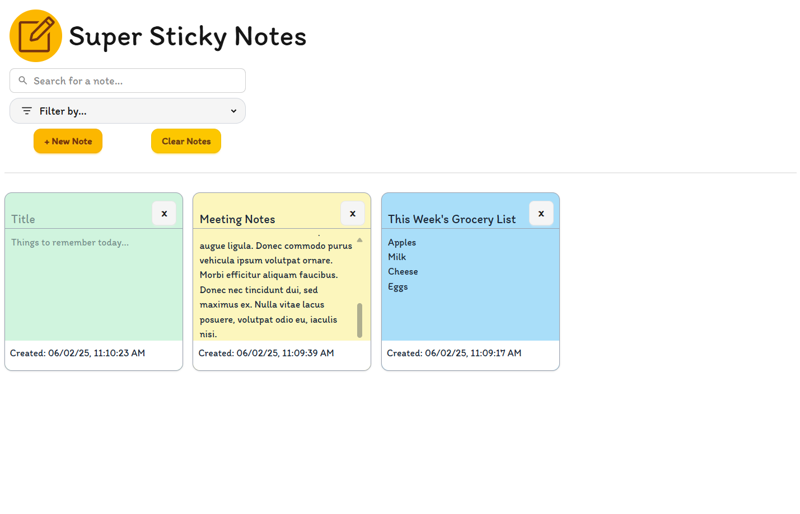

# Super Sticky Notes

If you don't write it down, you'll forget. Trust me.

A React app that keeps track of everything important with sticky notes. Notes are saved in the local browser to revisit again and again when needed.

### Built with:

    

- Motion (formerly Framer Motion)
- Icons
  - Iconify

### Deployment

https://ang-riv.github.io/sticky-notes/

## Introduction

Super Sticky Notes makes it easy to remember what you need to remember.

## Features

- **Dynamic Search:** find a note with a specific keyword in both the title and the main text fast with the search function.
- **Filter:** find a note by date or color.
- **Note Colors:** make a note stand out by making it a specific color.
- **Confirm Deletion:** to prevent notes from being deleted by accident, an alert will pop up to confirm deletion.
- **Clear Notes:** get rid of all the notes once you don't need it any more using the clear notes button.
- **Scrollable Note:** each note is scrollable, so add in as much text as you want!

## Challenges

- **Problem**: Things that needed to work together were separated. Initially, the project was done in seperate components right away without taking into account what would need to work with what.
  - **Solution**: Re-did the project all in one big component before figuring out what can be separated into smaller components.
- **Problem**: Filtering notes based on date. Notes weren't showing up in order if they were created on the same day, especially if they were created very close in time to each other.
  - **Solution**: Included the full date in each note down to the second.

## Future Updates

- Tags to further organize notes using the filter function
- Multi-select notes to delete several notes
- Alert confirmtation for Clear Notes button
